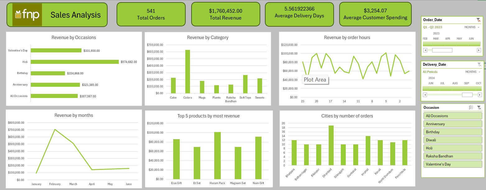

# Ferns & Petals Sales Dashboard (Excel Project)

## Project Overview
This project focuses on building an **interactive Excel dashboard** for **Ferns & Petals (FNP)**, an online gifting company.  
The goal was to analyze customer, order, and product data to generate insights that help understand **sales trends, customer spending patterns, product performance, and seasonal demand**.  

The project demonstrates skills in **data cleaning, transformation, modeling, and visualization** using Excel’s advanced tools.

---

## Tools & Techniques Used
- **Power Query Editor** → Data extraction, cleaning & transformation (ETL)  
- **Power Pivot** → Data modeling using relationships (Star Schema)  
- **Pivot Tables & Measures (DAX)** → Aggregated analysis & KPIs  
- **Excel Charts & Slicers** → Interactive dashboard creation  
- **Executive Summary** → Key insights & recommendations  

---

## Dataset
The dataset consists of three CSV files:
- `Customers.csv` → Customer details (name, city, gender, contact, etc.)  
- `Orders.csv` → Order details (order ID, customer ID, product ID, order/delivery dates, time, location, occasion)  
- `Products.csv` → Product details (ID, name, category, price, occasion)  

---

## Key Business Questions Answered
1. What is the **total revenue**?  
2. What is the **average order-to-delivery time**?  
3. How is the **monthly sales performance**?  
4. What are the **top products by revenue**?  
5. How much does a customer spend on average (**AOV - Average Order Value**)?  
6. How do **sales vary by category & occasion**?  
7. Which are the **top 10 cities by number of orders**?  
8. Is there a **correlation between order quantity and delivery time**?  
9. Which products are most popular during specific **occasions**?  

---

## Dashboard Features
- **KPIs at the top**:
  - Total Orders  
  - Total Revenue  
  - Average Delivery Time  
  - Average Customer Spending  

- **Interactive Visuals**:
  - Revenue by Occasion  
  - Revenue by Product Category  
  - Monthly Sales Trend  
  - Top 5 Products by Revenue  
  - Top 10 Cities by Orders  
  - Customer Ordering Patterns (Time & Weekday Analysis)  

- **Filters (Slicers & Timelines)**:
  - By **occasion, month, and delivery date**  

---

## 📌 Key Insights
- Highest sales occur during **festive occasions** (Diwali, Rakshabandhan, Valentine’s Day).  
- **Soft toys, sweets, and colors** are the top categories driving revenue.  
- **Average delivery time** ≈ 5–6 days.  
- Customers spend **$3,500 on average per order**.  
- Most orders are placed in the **evening (7–8 PM)**.  

---

## 🚀 How to Use
1. Download the dataset (CSV files).  
2. Open the Excel file with **Power Query & Power Pivot enabled**.  
3. Refresh queries to load the dataset.  
4. Interact with the dashboard using **slicers & timelines**.  

---

Feel free to fork this repo, raise issues, or suggest improvements.  

---
